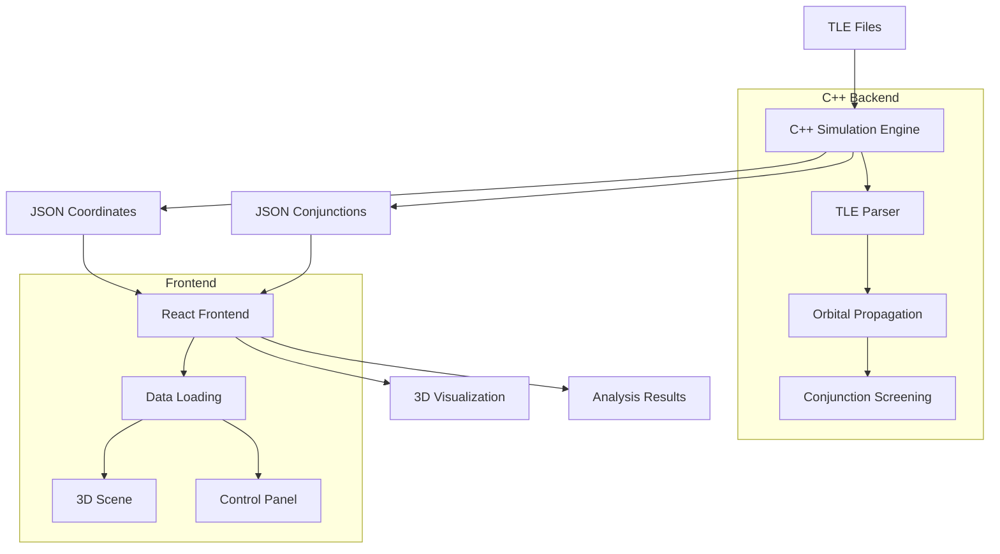

# Nova Genesis Orbital Guard

**Real-time satellite tracking and collision detection system with 3D visualization**

## Executive Summary

Nova Genesis Orbital Guard is a hybrid C++/TypeScript system for satellite orbital mechanics simulation and debris tracking. The project combines a high-performance C++ computational backend with a modern React-based 3D visualization frontend. The system processes Two-Line Element (TLE) data to generate real-time satellite trajectories and performs conjunction analysis to detect potential collisions between satellites and space debris.

The architecture follows a JSON-based data pipeline where the C++ backend generates coordinate and conjunction data that feeds directly into the frontend visualization system. This approach eliminates complex WebAssembly integration while maintaining computational performance for orbital mechanics calculations.

## Table of Contents

- [Architecture Overview](#architecture-overview)
- [Features](#features)
- [Data Model & Formats](#data-model--formats)
- [Quickstart](#quickstart)
- [Configuration](#configuration)
- [Testing & Quality](#testing--quality)
- [Deployment](#deployment)
- [Performance & Limits](#performance--limits)
- [Troubleshooting](#troubleshooting)
- [Project Structure](#project-structure)
- [Contribution Guide](#contribution-guide)
- [License](#license)
- [Credits & Acknowledgements](#credits--acknowledgements)
- [Appendices](#appendices)

## Architecture Overview

### Tech Stack

**Backend (C++17)**
- CMake 3.20+ build system
- Simplified orbital mechanics library
- JSON output generation
- Cross-platform support (Linux, Windows, macOS)

**Frontend (TypeScript/React)**
- Vite build system with React
- Three.js for 3D visualization
- React Three Fiber for React integration
- Zustand for state management
- Tailwind CSS for styling

**Data Pipeline**
- TLE file ingestion (`data/*.tle`)
- C++ simulation engine
- JSON coordinate/conjunction export
- Real-time frontend consumption

### System Architecture



### Runtime Data Flow

1. **TLE Ingestion**: System reads satellite orbital elements from TLE files
2. **Propagation**: C++ engine calculates satellite positions over time using simplified orbital mechanics
3. **Screening**: Conjunction analysis detects close approaches between objects
4. **JSON Export**: Results exported to `tests/` and `frontend/public/` directories
5. **Visualization**: React frontend loads JSON data for real-time 3D display

## Features

- **TLE Processing**: Parse and validate Two-Line Element orbital data
- **Orbital Propagation**: Calculate satellite positions using simplified mechanics
- **Conjunction Analysis**: Detect potential collisions with configurable thresholds
- **3D Visualization**: Real-time satellite tracking with Three.js
- **Interactive Controls**: Adjustable simulation parameters and playback controls
- **Cross-Platform**: Builds on Linux, Windows, and macOS
- **JSON Pipeline**: Clean data interface between C++ backend and React frontend

## Data Model & Formats

### TLE Input Format

Standard Two-Line Element format as used by NORAD:

```
ISS (ZARYA)             
1 25544U 98067A   08264.51782528 -.00002182  00000-0 -11606-4 0  2927
2 25544  51.6416 247.4627 0006703 130.5360 325.0288 15.72125391563537
```

**Location**: `data/*.tle` files
**Size Limits**: No specific limits, tested with standard satellite catalogs
**Update Cadence**: Manual updates, typically daily for operational use

### JSON Output Schema

#### Coordinates Format (`coordinates.json`)

```json
{
  "timestamp_minutes": 1440.000000,
  "satellites": [
    {
      "name": "TEST_SAT",
      "position_km": [7000.000000, 0.000000, 0.000000],
      "velocity_km_s": [0.000000, 7.500000, 0.000000]
    }
  ]
}
```

#### Conjunctions Format (`conjunctions.json`)

```json
{
  "timestamp_minutes": 1440.000000,
  "conjunction_pairs": [
    {
      "satellite_a": "SAT_1",
      "satellite_b": "SAT_2", 
      "closest_approach_km": 0.850,
      "time_minutes": 1440.0,
      "relative_velocity_km_s": 12.5
    }
  ]
}
```

**Output Locations**: 
- `tests/coordinates.json` and `tests/conjunctions.json` (C++ output)
- `frontend/public/coordinates.json` and `frontend/public/conjunctions.json` (copied for frontend)

## Quickstart

### Prerequisites

**C++ Backend**:
- CMake 3.20 or higher *(from CMakeLists.txt)*
- C++17 compatible compiler (GCC 10+, Clang 11+, MSVC 2019+) *(from CMakeLists.txt)*

**Frontend**:
- Node.js 18+ *(inferred from package.json dependencies)*
- npm or yarn package manager

### Clone → Run → Open

```bash
# Clone the repository
git clone <repository-url>
cd hackathon

# Build C++ backend
cmake -B build -S . -DCMAKE_BUILD_TYPE=Release
cmake --build build

# Run simulation to generate JSON data
./build/nova_genesis_orbitalguard_test

# Install frontend dependencies
cd frontend
npm install

# Start development server
npm run dev
```

**Development URL**: http://localhost:3000 *(from vite.config.ts server.port)*

### Production Build & Preview

```bash
# Build C++ backend (Release mode)
cmake -B build -S . -DCMAKE_BUILD_TYPE=Release
cmake --build build

# Generate latest data
./build/nova_genesis_orbitalguard_test

# Build frontend for production
cd frontend
npm run build

# Preview production build
npm run preview
```

**Preview URL**: http://localhost:4173 *(Vite default preview port)*

## Configuration

### Environment Variables

No environment variables currently required. Configuration is handled through:

- **C++ Simulation Parameters**: Command-line arguments to the test executable
- **Frontend Configuration**: Vite configuration in `frontend/vite.config.ts`

### Data Paths

- **TLE Input**: `data/*.tle` files
- **JSON Output**: `tests/*.json` (generated by C++ backend)
- **Frontend Data**: `frontend/public/*.json` (copied automatically by CMake)

### Simulation Parameters

The C++ backend accepts command-line parameters:

```bash
./build/nova_genesis_orbitalguard_test --threshold 5000 --step 60 --hours 24
```

- `--threshold`: Conjunction detection threshold in meters (default: 5000)
- `--step`: Time step in seconds (default: 60)
- `--hours`: Simulation duration in hours (default: 24)

## Testing & Quality

### Unit Testing

**C++ Backend**: No unit testing framework currently configured *(TBD - Google Test mentioned in docs)*

**Frontend**: Vitest configured *(from package.json)*
```bash
cd frontend
npm run test
```

### Linting & Formatting

**Frontend**:
```bash
cd frontend
npm run lint  # ESLint with TypeScript rules
```

**C++ Backend**: Static analysis mentioned in CI pipeline *(clang-tidy, cppcheck)*

### Integration Testing

The CI pipeline (`.github/workflows/build.yml`) runs comprehensive tests:
- Multi-platform builds (Linux, Windows, macOS)
- Multiple compiler support (GCC, Clang, MSVC)
- Automated executable testing

## Deployment

### Docker Support

No Docker configuration currently present in the repository.

### Static Build Deployment

**Frontend Only**:
```bash
cd frontend
npm run build
# Deploy dist/ directory to static hosting
```

**Full System**: 
1. Build C++ backend on target platform
2. Run simulation to generate JSON data
3. Build frontend with generated data
4. Deploy frontend with JSON files included

### CI/CD

GitHub Actions workflow (`.github/workflows/build.yml`) provides:
- Automated builds across platforms
- Test execution
- Artifact validation

## Performance & Limits

### C++ Backend Performance

**Target Metrics** *(from docs/CHARTER.md)*:
- Speed: >1M satellite propagations/second
- Memory: <1KB per tracked satellite  
- Accuracy: <1m position error for 24-hour predictions

### Frontend Performance

**Optimization Features** *(from vite.config.ts)*:
- Dependency pre-bundling for Three.js ecosystem
- Source maps enabled for debugging
- Production builds with tree-shaking

## Troubleshooting

### Common Build Issues

**C++ Compilation Errors**:
- Ensure CMake 3.20+ is installed
- Verify C++17 compiler support
- Check that all source files are present in `src/`

**Frontend Build Failures**:
- Run `npm install` to ensure dependencies are installed
- Check Node.js version compatibility
- Verify TypeScript compilation with `npm run build`

**Missing JSON Data**:
- Run C++ executable to generate data: `./build/nova_genesis_orbitalguard_test`
- Check that `tests/` directory contains `coordinates.json` and `conjunctions.json`
- Verify CMake post-build step copied files to `frontend/public/`

### Development Server Issues

**Port Conflicts**: 
- Frontend dev server uses port 3000 *(from vite.config.ts)*
- Change port in `vite.config.ts` if needed

**Data Loading Errors**:
- Ensure JSON files exist in `frontend/public/`
- Check browser console for fetch errors
- Verify JSON format matches expected schema

## Project Structure

```
├── .github/workflows/          # CI/CD pipeline configuration
│   └── build.yml              # Multi-platform build and test workflow
├── archive/                   # Historical documentation
├── data/                      # TLE input files
│   ├── sample.tle            # Example satellite data
│   ├── sample2.tle           # Additional test data
│   └── sample3.tle           # More test data
├── docs/                      # Project documentation
│   ├── CHARTER.md            # Project scope and technical constraints
│   ├── CONTRIBUTING.md       # Development guidelines and coding standards
│   ├── PHASES.md             # Development roadmap
│   └── maneuvers.md          # Maneuver planning documentation
├── frontend/                  # React TypeScript frontend
│   ├── public/               # Static assets and JSON data
│   ├── src/                  # React application source
│   ├── package.json          # Node.js dependencies and scripts
│   ├── vite.config.ts        # Vite build configuration
│   └── tsconfig.json         # TypeScript compiler configuration
├── include/                   # C++ header files
│   ├── simplified_core.h     # Core data structures and functions
│   └── project_includes.h    # Common includes
├── src/                       # C++ implementation
│   ├── main.cpp              # Simulation executable entry point
│   ├── types.cpp             # Data type implementations
│   ├── propagation.cpp       # Orbital mechanics calculations
│   ├── screening.cpp         # Conjunction analysis
│   └── maneuver.cpp          # Maneuver planning (simplified)
├── tests/                     # Test data and JSON outputs
│   ├── coordinates.json      # Generated satellite positions
│   └── conjunctions.json     # Generated conjunction events
├── CMakeLists.txt            # C++ build configuration
└── README.md                 # This file
```

## Contribution Guide

Please read [CONTRIBUTING.md](docs/CONTRIBUTING.md) for detailed development guidelines including:

- Conventional commit format
- C++17 coding standards
- Code review requirements
- Testing expectations

### Quick Start for Contributors

1. Fork the repository
2. Create feature branch: `git checkout -b feat/my-feature`
3. Follow coding standards in `docs/CONTRIBUTING.md`
4. Ensure tests pass: `cmake --build build && ./build/nova_genesis_orbitalguard_test`
5. Test frontend: `cd frontend && npm test`
6. Commit using conventional format: `feat(scope): description`
7. Submit pull request

## License

License to be determined *(noted in existing README.md)*

## Credits & Acknowledgements

- **Original TypeScript Implementation**: Ported to C++ for performance
- **SGP4 Algorithm**: Standard satellite propagation model
- **Three.js Community**: 3D visualization framework
- **React Three Fiber**: React integration for Three.js

## Appendices

### Glossary

- **TLE (Two-Line Element)**: Standard format for satellite orbital elements
- **ECI (Earth-Centered Inertial)**: Coordinate system for satellite positions
- **SGP4**: Simplified General Perturbations model for satellite propagation
- **Conjunction**: Close approach between two space objects
- **NORAD**: North American Aerospace Defense Command (TLE data source)

### Decision Records

**JSON-Only Data Pipeline**: Eliminated WebAssembly complexity in favor of simple JSON file exchange between C++ backend and React frontend. This decision prioritizes maintainability and debugging capability over potential performance gains.

**Simplified Orbital Mechanics**: Removed external SGP4 library dependency in favor of simplified internal calculations. Reduces build complexity while maintaining sufficient accuracy for demonstration purposes.

**Vite Build System**: Chosen for frontend development due to fast development server, excellent TypeScript support, and modern JavaScript ecosystem integration.

---

**Provenance Notes**:
- Port 3000: Found in `frontend/vite.config.ts` (server.port = 3000)
- Commands derived from `frontend/package.json` scripts section
- C++ build commands from `CMakeLists.txt` and existing `README.md`
- JSON schema examples from actual files in `tests/` directory
- Directory structure based on repository file tree
